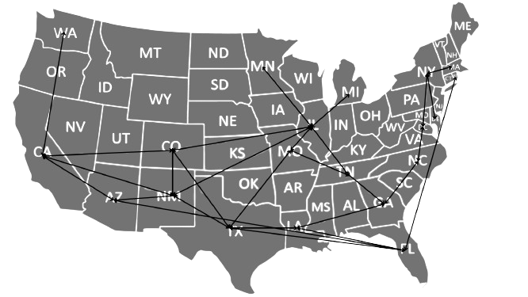
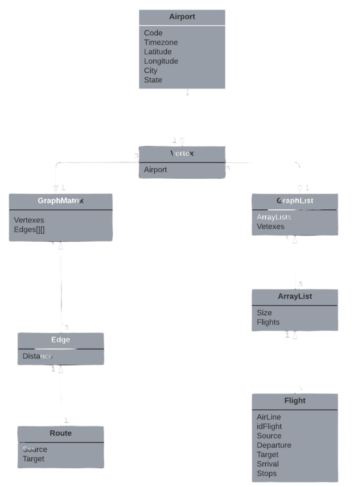

# AEROGRAPH

## INTRODUÇÃO
A eficiente gestão de horários e rotas das companhias aéreas demanda uma abordagem estruturada e intuitiva. Na modelagem dessa complexidade logística, os grafos desempenham um papel crucial, representando cidades/aeroportos como vértices e rotas/voos como arestas. Duas representações principais, Grafo de Listas de Adjacências e Grafo de Matriz de Adjacências, são empregadas para otimizar diferentes contextos, como voos diretos e rotas entre todos os aeroportos.

Este trabalho apresenta o AeroGraph, um sistema projetado para o controle inteligente de voos e rotas aéreas. A arquitetura em camadas do AeroGraph busca promover a manutenção e extensibilidade do sistema.

Ao longo do desenvolvimento, foram implementadas funcionalidades essenciais, como cálculo de distâncias entre aeroportos utilizando o algoritmo BFS, pesquisa eficiente de voos diretos com Lista de Adjacência, menor custo em distância e tempo com o Algoritmo de Dijkstra, verificação de alcançabilidade e ciclos hamiltonianos com o algoritmo DFS, e uma visão abrangente de todas as rotas e voos disponíveis.

Este trabalho destaca as escolhas algorítmicas e estruturais, enfatizando a robustez e eficiência do AeroGraph na gestão inteligente de dados complexos no contexto dinâmico das operações aéreas.
## Desenvolvimento
### Arquitetura e design

O AeroGraph é um sistema projetado com uma arquitetura em camadas, visando uma clara separação de responsabilidades para facilitar a manutenção e extensibilidade. A arquitetura consiste em duas camadas principais: a Interface do Usuário e a Lógica de Negócios.

#### Entities
- Contém as entidades principais do programa, como aeroportos, rotas e arestas.

#### Files
- Armazena todos os arquivos .txt para carregar dados, incluindo um manipulador de arquivos.

#### Services
- Realiza a maioria das operações exigidas, como manipulação de aeroportos, grafos de rotas e grafos de voos. Essas funcionalidades serão detalhadas mais adiante.

#### Sounds
- Armazena e manipula os áudios do programa.

#### Structures
- Armazena estruturas tradicionais como arestas, vértices, listas, filas, e grafos em lista e matriz de adjacência.

#### Utils
- Armazena diversas funções de funcionalidades diversas, como mudança de cores no terminal.

#### Views
- Responsável por mostrar ao usuário o que o programa está executando, além de controlar as opções e o menu principal.

Esta arquitetura em camadas oferece uma base sólida para o desenvolvimento do AeroGraph, promovendo clareza nas responsabilidades e facilitando futuras expansões e manutenções no sistema.

### Funcionalidades Exigidas

1. **Cálculo da Distância entre Aeroportos: Algoritmo BFS**

   O algoritmo de Busca em Largura (BFS) foi escolhido para calcular o caminho entre dois aeroportos devido à sua natureza exploratória e à eficiência na análise de grafos. Ao iniciar a busca a partir do aeroporto de origem, o BFS expande sistematicamente para todos os aeroportos conectados, camada por camada. Essa abordagem garante que, ao encontrar o destino desejado, o algoritmo retorne aquele caminho, ele utiliza a técnica do _branch and bound_. A escolha do BFS visa oferecer uma visão global das conexões disponíveis, possibilitando ao usuário explorar não apenas uma rota qualquer, mas também alternativas que podem ser relevantes em determinados contextos, como escalas ou preferências específicas.

2. **Pesquisa de Voos Diretos: Grafo de Voos e Lista de Adjacência**

   A utilização de um grafo de voos representado como uma lista de adjacência é uma escolha estratégica para a pesquisa de voos diretos. Esta representação permite uma busca direcionada e eficiente. Quando o usuário fornece o código de um aeroporto, o programa consulta a lista correspondente na lista de adjacência. Essa abordagem é vantajosa em termos de desempenho, pois evita percorrer toda a matriz de adjacência, focando apenas nas conexões relevantes. A escolha da lista de adjacência destaca-se pela sua eficiência em operações de busca, otimizando a resposta ao usuário.

3. **Viagem com Menor Custo em Distância e Tempo: Algoritmo de Dijkstra**

   O algoritmo de Dijkstra foi escolhido para encontrar o menor caminho em distância devido à sua eficácia em grafos ponderados. Ao operar sobre o grafo de rotas, que é representado como uma matriz de adjacência, o Dijkstra calcula de forma precisa o caminho ótimo entre dois aeroportos. Essa escolha é fundamentada na capacidade do algoritmo de lidar eficientemente com grafos densos, proporcionando resultados rápidos e precisos. Além disso, para a opção de menor tempo, a busca no grafo de voos é realizada, oferecendo ao usuário flexibilidade na escolha do itinerário, adaptando-se às suas preferências específicas.

4. **Verificação da Alcançabilidade de Todos os Aeroportos: Algoritmo DFS**

   A escolha do algoritmo de Busca em Profundidade (DFS) para verificar a alcançabilidade de todos os aeroportos a partir de uma origem é baseada na sua capacidade de explorar a fundo o grafo de rotas. O usuário escolhe um aeroporto de origem, e o DFS busca um caminho que percorre todos os outros aeroportos. O DFS é particularmente útil para identificar a conectividade global do sistema, proporcionando uma visão abrangente das rotas disponíveis. A escolha do DFS visa a eficiência na verificação da interconectividade de todos os aeroportos a partir de um ponto central.

5. **Verificação de Ciclos Hamiltonianos: Algoritmo DFS com Parâmetro Específico**

   Para verificar ciclos hamiltonianos e evitar duplicação de código, o algoritmo DFS foi novamente escolhido. O DFS é adaptado com um parâmetro específico para detectar ciclos hamiltonianos, garantindo que o caminho encontrado seja não apenas completo, passando por todos os aeroportos, mas também livre de repetições. Essa escolha assegura a robustez do programa ao explorar possíveis circuitos dentro do grafo de rotas, contribuindo para a integridade e confiabilidade das informações apresentadas.

6. **Exibição de Todas as Rotas e Voos: Visão Abrangente**

   A escolha de exibir todas as rotas e voos disponíveis no sistema reforça a transparência e a abrangência do programa. Ao utilizar a representação do grafo, essa funcionalidade oferece ao usuário uma visão completa das opções de viagem. A abordagem destaca-se pela sua simplicidade e clareza, proporcionando uma compreensão holística da rede de aeroportos. Essa escolha visa aprimorar a experiência do usuário, permitindo uma exploração fácil e abrangente das possibilidades disponíveis.

Ao compreender as razões por trás da escolha de cada algoritmo, os usuários podem apreciar a robustez e eficiência do programa na manipulação inteligente de dados complexos, oferecendo uma experiência aprimorada na exploração da rede de aeroportos e voos.

### Diagrama de relação entre estruturas de dados

## CONCLUSÃO
O desenvolvimento do AeroGraph reflete a aplicação bem-sucedida de conceitos fundamentais da teoria dos grafos na gestão eficiente de voos e rotas aéreas. Ao adotar representações como Grafo de Listas de Adjacências e Grafo de Matriz de Adjacências, conseguimos otimizar a modelagem conforme a natureza esparsa ou densa das conexões aéreas.

A arquitetura em camadas do AeroGraph proporcionou uma base sólida para a implementação das funcionalidades, promovendo clareza nas responsabilidades e facilitando futuras expansões. A escolha cuidadosa de algoritmos, como BFS, Dijkstra e DFS, destacou-se na resolução eficiente de problemas específicos, desde cálculos de distância até a verificação de ciclos hamiltonianos.

A transparência e abrangência do sistema, evidenciadas pela exibição de todas as rotas e voos disponíveis, reforçam a proposta de oferecer ao usuário uma visão completa das opções de viagem. A integração inteligente de estruturas de dados e algoritmos contribuiu para a robustez do programa, tornando-o capaz de lidar com a complexidade inerente às operações aéreas.

Em última análise, o AeroGraph representa não apenas um sistema de controle de voos e rotas, mas uma abordagem inteligente e eficaz para a gestão aérea. A compreensão das escolhas algorítmicas e estruturais destaca a engenhosidade por trás do desenvolvimento, oferecendo aos usuários uma ferramenta que não apenas atende às suas necessidades imediatas, mas que também está preparada para evoluir e enfrentar os desafios em constante mudança do cenário aéreo.

1. **Carvalho, Bruno Miguel Pacheco Saraiva de**. *Algoritmo de Dijkstra.*  
   Departamento de Engenharia Informática, Universidade de Coimbra, 3030 Coimbra, Portugal.  
   Email: brunomig@student.dei.uc.pt.  
   [Artigo](https://student.dei.uc.pt/~brunomig/cp/Artigo.pdf)

2. **Bilésimo, Vanessa Felisberto; Porfírio, Patrícia José; da Silva, Westphal; Sim, Priscyla Waleska Targino de Azevedo; Azevedo, Silvana Campos de**.  
   *Implementação do algoritmo de busca em profundidade em um grafo: Utilização da Biblioteca Padrão do C++ - STL.*  
   [Artigo](https://www.periodicos.unesc.net/ojs/index.php/sulcomp/article/view/910)

3. **Mexas, Mirian Picinini**.  
   *Um Estudo sobre Técnicas de Busca em Grafos e Suas Aplicações.*  
   [Artigo](https://www.pesc.coppe.ufrj.br/uploadfile/1368208720.pdf)

4. **Feofiloff, Paulo**.  
   *Busca em Largura.*  
   [Artigo](https://www.ime.usp.br/~pf/algoritmos_para_grafos/aulas/bfs.html)

---

*Autor: João Felipe Silva Lamounier*

